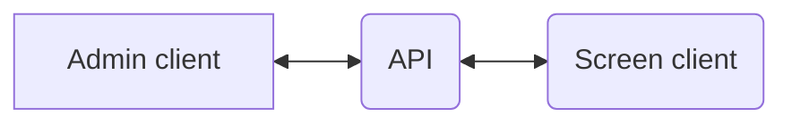

# Display-docs

Documentation for OS2Display

    
## API service

This is the main component of the system. All content is created/retrieved through api calls to the API service.
The API service is a [Symfony](https://symfony.com/) project built with [API Platform](https://api-platform.com/).
See [api-service.md](api-service.md) for further descriptions.

@TODO: Gather information about the api service in this repo.

## Admin

This is where content, connections and screens are created and connected. 
[Go to description of admin elements](https://github.com/os2display/display-admin-client#system-description).
The admin is built with [React](https://reactjs.org/).
See [admin.md](admin.md) for further descriptions.

@TODO: Gather information about the admin in this repo.

## Client 

This is the output screen where the content will be displayed.
The screen client is built with [React](https://reactjs.org/).
See [client.md](client.md) for further descriptions.

@TODO: Gather information about the client in this repo.

### Important nodes

Scheduling and campaigns will be activated when

  * their start time has been reached
  * (and) the current playlist has reached its end

to make ensure proper transitions.
 
# Changelog

See [changelog.md](changelog.md) for a list of changes.

## Roadmap

See [roadmap.md](roadmap.md) for a plan upcoming changes.

## Development setup

See [development.md](development.md) for a description of how to make changes to the project.

## Templates

See [templates.md](templates.md) for a description of how templates work and how to make new.

## Feeds

See [feeds.md](feeds.md) for a description of how feeds are set up.
