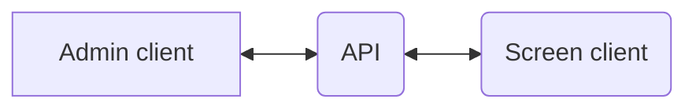

# Display-docs
Documentation for OS2Display version 2

    
## API
This is the backbone of the system that connects the conponents together. 

## Admin client
This is where content, connections and screens are created and connected. 
<a href="https://github.com/os2display/display-admin-client#system-description">Go to description of admin elements</a>

## Screen client 
This is the output screen where the content will be displayed.

### Important nodes
* Scheduling and campaigns will be activated when a)their start time has been reached and b)playlists have reached end, to make sure there will be a nice transit
* Browser refresh will continue the playlist where it is but get now content

# Changelog
[changelog.md](changelog.md)
