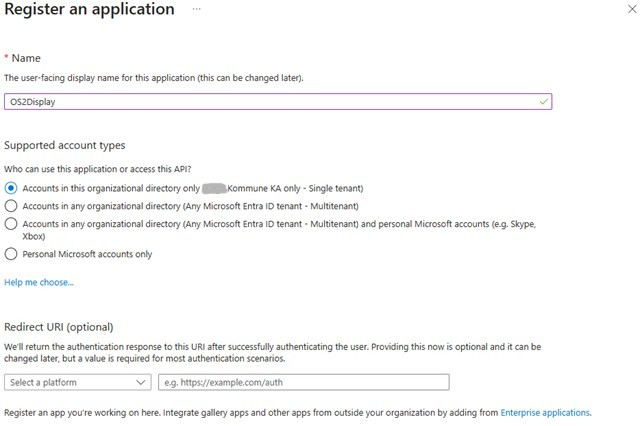
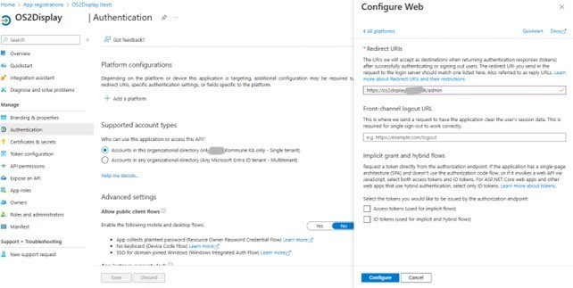
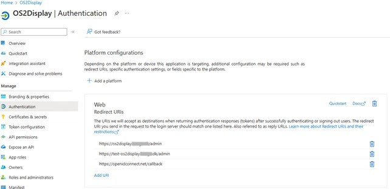

# SSO setup

This documentation will guide you through the setup of Single Sign-On (hereinafter SSO) in OS2display.

OS2display supports SSO via OpenID Connect, which both Azure and OS2faktor can use. You will find guides for setup in both Azure and OS2faktor further down in this documentation.

This guide consists of these topics
* [Setup in OS2display](sso_setup.md#setup-in-os2display)
* [Setup in Azure](sso_setup.md#setup-in-azure)
* [Setup in OS2faktor](sso_setup.md#setup-in-os2faktor)

## Setup in OS2display

In the file "**.env.local**", the following variables must be filled in with values ​​that you get from either Azure or OS2faktor \- depending on which of these solutions you choose to use to create SSO.

* **INTERNAL\_OIDC\_METADATA\_URL**  
  This is filled in with the link to metadata.
* **INTERNAL\_OIDC\_CLIENT\_ID**  
  This is filled in with the client id.
* **INTERNAL\_OIDC\_CLIENT\_SECRET**  
  This is filled in with the client secret.
* **INTERNAL\_OIDC\_REDIRECT\_URI**  
  This is filled in with the link to the OS2display solution (incl. "/admin"). Example: https://display.bellcom.dk/admin
* **INTERNAL\_OIDC\_LEEWAY**  
  This is filled in with the number of minutes that a successful login lasts. Default is 30.
* **INTERNAL\_OIDC\_CLAIM\_NAME**  
  This is filled with the name of the claim where the user's name appears. Note, this must be a string - not an array!
* **INTERNAL\_OIDC\_CLAIM\_EMAIL**  
  This is filled with the name of the claim where the user's email address appears. Note, this must be a string - not an array!
* **INTERNAL\_OIDC\_CLAIM\_GROUPS**  
  This is filled with the name of the claim where the user's rights appear. Note, this must be an array - not a string!

### Rights/Roles in OS2display
The value(s) (there can be more than one) in INTERNAL\_OIDC\_CLAIM\_GROUPS must end with either "Admin" or "Redaktoer", as this value is used to determine whether the user should be granted administrator rights (Admin) or editor rights (Redaktoer).

So if a user should have access to e.g. the department (or tenant, as it is called in OS2display) called "Library", then INTERNAL\_OIDC\_CLAIM\_GROUPS must have a value that is either "LibraryAdmin" or "LibraryRedaktoer" - depending on which role the user should have.

If a user needs access to multiple departments/tenants, the different departments/tenants and roles are provided, just in the same array. It’s possible to be an administrator in one department/tenant and an editor in another.

If a tenant has not been created and a user who has this tenant logs in, it will be created at the first login.

It may happen that when you log in and return to OS2display, you are greeted by a completely white screen instead of the option to choose between departments/tenants. We have not been able to provoke this error with a specific action. We have only seen this if a correction has been made to a user (e.g. if a new right is assigned or removed - but not every time one of the parts is done). This can be resolved by pressing CTRL \+ F5.

## Setup in Azure

This guide describes how to set up the OS2display service provider in Azure. The guide is aimed at IT administrators who need to ensure the correct configuration of the integration between OS2display and Azure.

### Configuring new App Registration

1. Log in to Entra ID, go to **App Registrations** and press **New registration**. [Direct link](https://entra.microsoft.com/#view/Microsoft_AAD_RegisteredApps/ApplicationsListBlade/quickStartType~/null/sourceType/Microsoft_AAD_IAM)  
   
2. Fill out the form as in the image and register the application.  
   
3. You will be automatically redirected to the settings for the new App Registration.  
   Under **Authentication**, specify which URIs are allowed to exchange information with and issue tokens to. Click **Add a platform**, select **Web** and add URIs for test and production environments.  
   Typically, this will be https://os2display.\[domainname\]/admin and https://test-os2display.\[domainname\]/admin.  
     
   For testing and debugging, [https://openidconnect.net/callback](https://openidconnect.net/callback) can also be added. This allows you to test SSO with the tool at [https://openidconnect.net/](https://openidconnect.net/).  
   
4. Under **API permissions**, the following permissions are granted. Tap on **Microsoft Graph** to grant permissions. Remember to **Grant admin consent** afterwards.  
   
5. Under **Token Configuration**, select which user information is sent in the token.  
   
6. Under **App roles**, add the roles that users should be able to be assigned. See the section "Rights/Roles in OS2display" further up for an explanation of how the values ​​should be.  
   In the example below, there are three areas with two permission levels, called roles, for each area. The value in **Value** must be as agreed. **Display Name** and **Description** can be filled in optionally.  
   
7. Under **Certificates & secrets**, create a **Client secret** with an expiration of 2 years. Remember to write down its **Value**, as it will not appear again.  
   
8. Now the different values ​​must be found and inserted into OS2display. See the section "Setup in OS2display" further up to see where to find the file.  
     
   * Under **Overview**, find **Application (client) ID** and insert this value into "INTERNAL\_OIDC\_CLIENT\_ID".
   * Click on **Endpoints**, and there you will find the value from the **OpenID Connect metadata document** and insert this value into "INTERNAL\_OIDC\_METADATA\_URL".
   * The **Value** you noted down in step 7 should be inserted into "INTERNAL\_OIDC\_CLIENT\_SECRET".

### Assigning rights
The OS2display application consists of two parts: App Registration and Enterprise Application. The previous points have all been in **App Registration**. Assigning rights to users/security groups takes place from the associated **Enterprise Application**.

If you are still in the **Overview** image from point 8 in the previous part of the guide, you can click on the OS2display link next to **Managed application in local directory**, and you will be taken to the **Enterprise Application**.

Alternatively, you can search for the OS2display Enterprise Application from [this link](https://entra.microsoft.com/#view/Microsoft_AAD_IAM/StartboardApplicationsMenuBlade/~/AppAppsPreview).

Under **Users and groups**, rights to OS2display, which are here called roles, can be assigned and removed. The role can be assigned directly to the user or to a security group.

If a user is to have rights to multiple areas in OS2display, the user must be assigned a corresponding role multiple times and will subsequently appear in the list multiple times.

## Setup in OS2faktor

This guide describes how to set up the service provider OS2display in OS2faktor. The guide is aimed at IT administrators who must ensure correct configuration of the integration between OS2display and OS2faktor.

Before starting the setup, the following prerequisites must be met:

* Administrator access to OS2faktor
* Administrator access to OS2rollekatalog

### Setup

1. **Create service provider in OS2faktor**
   * Log in to the OS2faktor administration panel.
   * Navigate to **Tjenesteudbydere**.
   * Click **Opret ny tjenesteudbyder**.
   * Enter information:
      * **Navn**: \<municipality name\>-OS2display
      * **Angiv subjekt**: upn
      * **Klienttype**: Confidential client
      * **Redirect URI**: Enter the address that OS2display uses for authentication. Typically, this will be https://os2display.\[domainname\]/admin and https://test-os2display.\[domainname\]/admin
   * Click **Save**, and note the *Client ID* and *Client Secret* (will be used later).
2. **Find and note metadata link**
   * Navigate to **Tjenesteudbydere** in OS2faktor, and find metadata information (URL to OpenID Connect metadata).
   * Note the link (will be used later).
3. **Claims setup**
   * Go to **Claims-konfiguration for OS2display**.
   * Create the following Claims:
      * **email**: Set up personal claim type, select attribute email, and check send only one value. Enter the claim name email.
      * **name**: Set up personal claim type, select attribute name, and check send only one value. Enter the claim name name.
      * **roles**: Set up OS2rolecatalog claim type, select operation all assigned system roles, and specify OS2display as argument (note this argument as it is used in the role catalog). Enter the claim name roles.
   * Click **Save** and verify the setup.
4. **Security groups setup in Rollekataloget**
   * Go to **Rollekataloget**.
   * Create *SAML integration*.
   * Name the IT system (e.g. OS2display).
   * Enter contact email.
   * Enter the argument you entered in your claim for *roles* in OS2faktor, e.g. OS2display as system ID.
   * Add SAML roles, and enter a unique technical ID per SAML role.
5. **Insert the values ​​in OS2dislay**  
   As written under "Setup in OS2display" further up, the values ​​must be inserted into OS2display.
   * The link to metadata must be inserted at "INTERNAL\_OIDC\_METADATA\_URL".
   * Client ID must be inserted at "INTERNAL\_OIDC\_CLIENT\_ID".
   * Client Secret must be inserted at "INTERNAL\_OIDC\_CLIENT\_SECRET".
   * The names of the claims created under point 3 must be inserted at "INTERNAL\_OIDC\_CLAIM\_NAME", "INTERNAL\_OIDC\_CLAIM\_EMAIL" and "INTERNAL\_OIDC\_CLAIM\_GROUPS".
6. **Testing and Validation**  
   After setup, the integration should be tested:
   * Log in to OS2display via OS2faktor and confirm that users can authenticate.
   * Check the event log in OS2faktor to see the login token (should match expected claims).
   
   * Check that correct user information is transferred (claims).
   * Confirm access control via security groups.
7. **Troubleshooting**  
   If the integration does not work as expected, the following should be checked:
   * Is the metadata link correctly sent to the supplier?
   * Are the *Client ID* and *Client Secret* correctly configured?
   * Are the claims correctly set up in OS2faktor?
   * Are the users correctly assigned to the relevant security Groups?

The setup of OS2display in OS2faktor is now complete. It is recommended to document the configuration internally and ensure that any adjustments are made during system updates.
